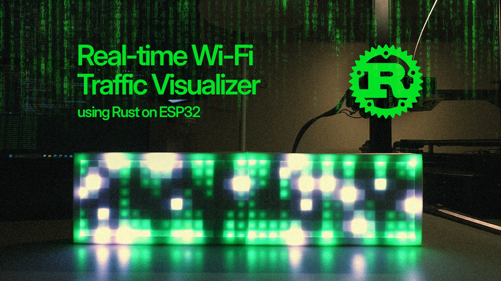

# Wifi Visualizer Using Rust on ESP32



This project uses an ESP32 microcontroller and a WS2812 LED matrix to create a visual representation of WiFi packets. The visualization mimics the cascading digital rain effect seen in The Matrix, with packets streaming down the LED matrix in a dynamic and fluid manner. The firmware is written in Rust, leveraging the esp-hal-smartled library for LED control and ESP WiFi for network connectivity. This creates an engaging way to monitor network activity in real time.

A YouTube video walking through this project can be found [here](https://youtu.be/NW_4bYAEQ04).

P/S: Technically, I'm a 2 days old Rust developer at the time of this repo publishment. So if you see a lot of unsafe blocks and static variables in my code instead of atomic structures, I know, I'm sorry :\_(

# Hardware Components

- **ESP32**: The microcontroller used for running the firmware. This can be any ESP32 variant that is supported by Esp-hal crate.
- **WS2812 Matrix**: An addressable RGB LED matrix controlled via a single data pin.

# Software Components

- **ESP WiFi**: Enables network connectivity for the ESP32.
- **esp-hal-smartled**: A Rust library for driving WS2812 and similar addressable LEDs.

# Installing the Toolchain & Building the Project

1. **Install Rust and Cargo**
   ```sh
   curl --proto '=https' --tlsv1.2 -sSf https://sh.rustup.rs | sh
   ```
2. **Install ESP32 Rust Toolchain**
   ```sh
   cargo install espflash espup
   espup install
   # In Unix systems, source the export file
   . $HOME/export-esp.sh
   ```
3. **Build and Flash the Firmware**
   ```sh
   cargo run --release
   ```

# Changing the Target for Different ESP32 Variants

To target a different ESP32 chip, modify the `target` field in the `.cargo/config.toml` file accordingly:

Then, build and flash:

```sh
cargo run --release
```

# Modifying LED Matrix Dimensions

To change the LED matrix dimensions, edit `main.rs`:

```rust
// Const Configuration
const ROW_SIZE: usize = <NEW_ROW_SIZE>;
const COL_SIZE: usize = <NEW_COL_SIZE>;
const LED_COUNT: usize = ROW_SIZE * COL_SIZE;
```

# Credits

Special thanks to Mark Kriegsman for the [Fire2012 visualization](https://blog.kriegsman.org/2014/04/04/fire2012-an-open-source-fire-simulation-for-arduino-and-leds/), which inspired parts of this project.

# License

This is just a for-fun weekend project, so it's free-for-all to use, distribute and modify. However, I would love to know if you are building something cool on top of this or inspired by this. Ping me at binhpham@binhph.am or tag me on social media.

Don't stop building and learning. From your friendly neighborhood guy who builds stuff.
